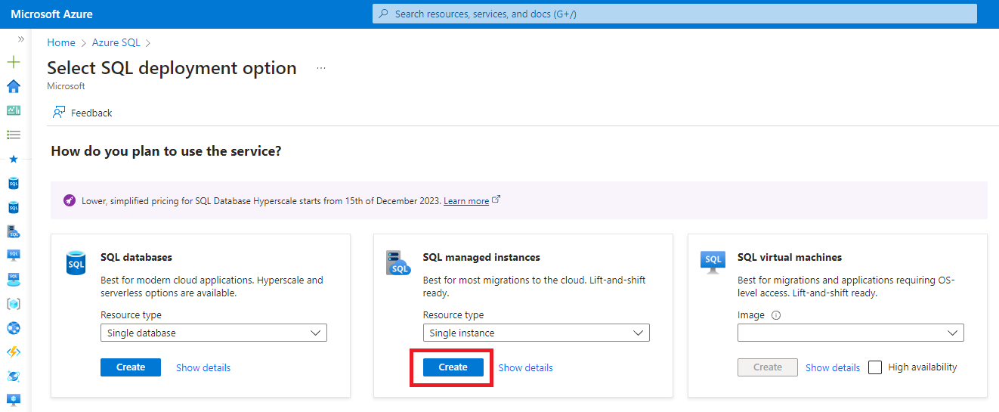
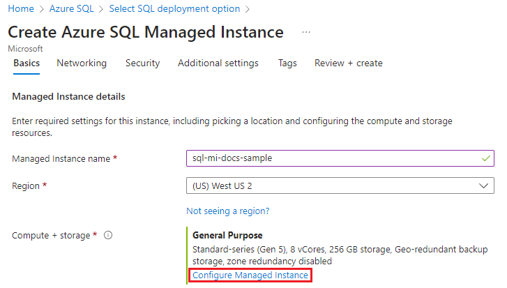

# Desafio do lab

## Configurações de uma instância de Banco de Dados no Azure

A seguir veremos o passo a passo para a configuração de uma instância de Banco de Dados na plataforma Microsoft Azure:

1. Faça o login no portal do Azure em http://www.portal.azure.com.
2. Clique em **Azure SQL** no menu lateral ou pesquise no campo de busca.
3. Clique no botão **Create** para abrir a página *Select SQL deployment options*.
4. No menu dropdown selecione *Single instance* e clique em **Create**.
  
5. Preencha o formulário na aba *Basics*. Algumas informações são obritatórias: Assinatura, grupo de recursos, nome da instância gerenciada, região, pertence a um pool de instâncias, método de autenticação, logon de administrador da Instância Gerenciada e senha.
6. Em *Managed Instance Details* clique em **Configure Managed Instance**:
   
7. Preencha os campos: Camada de serviços, Geração de hardware, vCores, Armazenamento em GB, Licença do SQL Server, Redundância do armazenamento de backup.
8. Clique no botão **Apply** e volte para continuar a configuração. Clique em **Next** para seguir para a aba **Networking**.
9. Preencha as informações da aba: Rede virtual / sub-rede, Tipo de conexão, Ponto de extremidade público, Permitir o acesso de (se o ponto de extremidade público estiver habilitado).
10. Na próxima aba, *Security*, deixe as informações padrão.
11. Na aba *Additional settings* preencha os campos ou deixe os valores padrão.
12. Adicione *Tags* para organizar os seus recursos.
13. Clique em **Review + Create**.
14. Monitore o progresso da implantação no botão **Notifications**: 
  
15. Selecione **Deployment in progress** para acessar e monitorar a instância que você acabou de criar.
16. Quando a implantação for concluída, acesse o grupo de recursos para exibir a instância criada:
  

Com isso finalizamos a configuração de uma instância de banco de dados SQL no Azure. Para criar um banco de dados siga os passos a seguir:
1. No [Portal do Azure](https://www.portal.azure.com) acesse o *SQL managed instance*.
2. Clique no botão **New database**:
  
3. Dẽ um nome ao banco de dados.
4. Na aba *Data source* selecione *None* para criar um banco de dados vazio.
5. Preencha as informações restantes e clique no botão **Review + create**.
6. Clique no botão **Create** para que seu banco de dados seja implantado.

Pronto! Seu banco de dados está configurado e pronto para ser usado.
